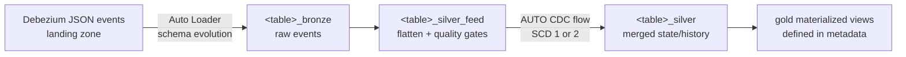

# debezium-cdc-pipeline — metadata-driven Debezium CDC ingestion

A production-grade, metadata-driven framework for ingesting Debezium
(MySQL) change-data-capture events into a Unity Catalog medallion
architecture, built on **Lakeflow Declarative Pipelines** (formerly
Delta Live Tables) using the current `pyspark.pipelines` Python API.

Adding a source table — whether it's the 10th or the 100th — is a
one-entry change in `config/tables.yaml`. No code changes.

## Architecture



Per table in the metadata, the pipeline registers:

| Dataset | Kind | Purpose |
|---|---|---|
| `<table>_bronze` | streaming table | Raw Debezium events via Auto Loader (inference + `addNewColumns` evolution, rescued-data warning). |
| `<table>_silver_feed` | temporary view | Envelope flattened (`before` for deletes, `after` otherwise), `_cdc_*` bookkeeping columns, metadata-defined expectations and column transforms. |
| `<table>_silver` | streaming table | `create_auto_cdc_flow` merge — SCD type 1 or 2, deletes applied, sequenced by `(ts_ms, binlog position)`. |

Gold materialized views are declared entirely in metadata (`name` +
`sql`).

## Project layout

```
debezium-cdc-pipeline/
├── databricks.yml                     # Asset Bundle: dev / test / prod targets
├── resources/cdc_pipeline.pipeline.yml# Pipeline resource (UC catalog/schema)
├── config/tables.yaml                 # Table + gold metadata ({env}-templated)
├── src/
│   ├── cdc_pipeline.py                # Pipeline entry point
│   └── cdc_framework/
│       ├── config.py                  # Metadata model + validating loader
│       ├── debezium.py                # Envelope constants/helpers (Spark-free)
│       └── flows.py                   # Dataset factories (pyspark.pipelines)
├── tests/                             # Unit tests (run anywhere, no Spark)
└── .github/workflows/ci.yml           # Lint, test, validate, deploy
```

## How a table is configured

```yaml
tables:
  - name: customers
    source_database: inventory   # or inherit from `defaults:`
    keys: [id]
    scd_type: 2                  # keep full history
    cluster_by: [id]             # liquid clustering on silver
    schema_hints: payload.after.balance DECIMAL(18,2)
    column_transforms:
      created_at: timestamp_millis(created_at)
    expectations:
      drop:
        valid_email: email IS NULL OR email LIKE '%@%'
      warn:
        positive_balance: balance >= 0
```

The landing path defaults to
`{landing_root}/{topic_template}` (e.g.
`/Volumes/cdc_dev/landing/debezium/mysql.inventory.customers`) and can
be overridden per table with `path:`. `{env}` placeholders resolve to
the `cdc.environment` pipeline setting.

Built-in safeguards applied to every table automatically:

- **Tombstones / malformed events** (`op IS NULL`) are dropped and
  counted in the pipeline event log.
- **Rows missing any primary-key column** are dropped (they cannot be
  merged deterministically) and counted.
- **Rescued data** (`_rescued_data IS NOT NULL`) raises a warning
  metric on bronze — nothing is silently lost.
- **Deterministic ordering**: events are sequenced by
  `struct(ts_ms, source.pos)` so same-millisecond update/delete pairs
  resolve by binlog position.

## Schema evolution

- **Bronze**: Auto Loader infers the schema and evolves it
  (`cloudFiles.schemaEvolutionMode=addNewColumns`). A new upstream
  column triggers one automatic stream restart, after which it flows
  through; values that don't fit the current schema land in
  `_rescued_data`.
- **Silver**: the feed view selects the row image dynamically from the
  current bronze schema, and the AUTO CDC flow evolves the silver
  table's schema automatically when new columns appear.
- **Types**: inference yields `bigint`/`double`/`string`/`boolean`.
  Debezium encodes temporal types as epoch integers — declare
  `column_transforms` (see example above) to materialize real
  dates/timestamps in silver, and/or use `schema_hints` for precise
  bronze types. For `DECIMAL` columns set
  `decimal.handling.mode=string` (or `double`) on the Debezium
  connector; the default base64-bytes encoding is not usable
  downstream.

## SDLC: dev → test → prod

The bundle defines three targets; each pins a Unity Catalog catalog
(`cdc_dev` / `cdc_test` / `cdc_prod`) and an environment name that
resolves the landing paths. Code and metadata are identical across
environments — only configuration differs.

```bash
databricks bundle validate -t dev
databricks bundle deploy   -t dev     # per-user dev copy (mode: development)
databricks bundle run      -t dev debezium_cdc

databricks bundle deploy   -t test    # via CI, as a service principal
databricks bundle deploy   -t prod    # via CI, gated release
```

Fill in the `workspace.host` (and `run_as` service principals for
test/prod) in `databricks.yml` before first use.

## CI/CD

`.github/workflows/ci.yml` implements the standard flow:

1. Every PR: `ruff` lint, `pytest` unit tests, `bundle validate`.
2. Merge to `main`: deploy to **test**.
3. Tag `v*`: deploy to **prod** (protect with a GitHub environment
   requiring reviewers).

Unit tests cover the metadata loader and Debezium helpers and run
without a Spark runtime. For integration testing, deploy to the dev
target and run the pipeline against sample events; validate results
with queries over the silver tables and the pipeline event log
(expectation metrics).

## Local development

```bash
pip install -e ".[dev]"
ruff check src tests
pytest
```

## Requirements and notes

- Databricks with Unity Catalog; pipeline `channel: CURRENT`
  (serverless). The code uses `pyspark.pipelines` (`dp`) — the current
  API. On older runtimes, `import dlt` exposes the same surface under
  legacy names (`dlt.apply_changes` etc.).
- Debezium connector recommendations: keep `tombstones.on.delete`
  defaults, use `decimal.handling.mode=string`, and land files
  partitioned by topic (`mysql.<db>.<table>/...`) as this framework
  expects.
- Changing `keys`, `scd_type`, or transforms for an existing table
  requires a full refresh of that table's flows to rewrite history.

## Deployment guide

### Prerequisites

- Databricks CLI ≥ 0.230 authenticated to each workspace
  (`databricks auth login --host <workspace-url>`).
- Unity Catalog catalogs per environment (defaults: `cdc_dev`,
  `cdc_test`, `cdc_prod` — override via bundle variables).
- A landing volume per environment matching `landing_root` in
  `config/tables.yaml` (default `/Volumes/cdc_<env>/landing/debezium`),
  with Debezium events landing under `mysql.<db>.<table>/` prefixes.
- For test/prod: a service principal per environment with permission to
  create pipelines and write to its catalog.

### One-time setup

1. In `databricks.yml`, set `workspace.host` for each target and
   `run_as.service_principal_name` for test and prod.
2. Review `config/tables.yaml`: landing root, table list, keys.
3. In GitHub, create `test` and `prod` environments, each with
   `DATABRICKS_HOST` and `DATABRICKS_TOKEN` secrets (service-principal
   tokens), and require reviewers on `prod`.

### Deploy and run — dev (manual)

```bash
databricks bundle validate -t dev
databricks bundle deploy   -t dev
databricks bundle run      -t dev debezium_cdc
```

`mode: development` prefixes all resources with your username, so every
engineer gets an isolated copy against the dev catalog.

### Deploy — test and prod (CI only)

- Merge a PR to `main` → CI lints, tests, validates, then deploys the
  bundle to **test** as the test service principal.
- Tag a release (`git tag v1.0.0 && git push --tags`) → CI deploys the
  same commit to **prod** after the gated approval.

No human deploys to test or prod by hand; the bundle is the only
deployment path, so workspaces never drift from git.

### Post-deploy verification

```sql
-- Row counts arrived in silver
SELECT COUNT(*) FROM cdc_prod.cdc.customers_silver;

-- Data-quality outcomes (dropped tombstones, key violations, warns)
SELECT * FROM event_log(TABLE(cdc_prod.cdc.customers_silver))
WHERE event_type = 'flow_progress';
```

### Rollback and re-processing

- **Code rollback**: deploy the previous git tag
  (`git checkout v0.9.0 && databricks bundle deploy -t prod`).
- **Data reprocessing**: run the pipeline with a full refresh for the
  affected tables (`databricks bundle run -t prod debezium_cdc
  --full-refresh <table>_bronze,<table>_silver`).
- **Dev teardown**: `databricks bundle destroy -t dev` removes a
  developer's copy cleanly.

### Running on Databricks Free Edition

This pipeline was verified end-to-end on Databricks Free Edition
(serverless). Two of that edition's constraints require deviating from
the defaults above; everything else works unchanged.

1. **Use the built-in `workspace` catalog.** Free Edition uses Default
   Storage, so the CLI cannot create catalogs (`databricks catalogs
   create` fails with *"Metastore storage root URL does not exist"*).
   Instead of `cdc_dev`, override the catalog variable at deploy time —
   no code changes, this is what the bundle variable is for.

2. **Point the landing root at a volume in that catalog.** Create the
   schemas and volume, then edit `landing_root` in
   `config/tables.yaml`:

   ```yaml
   landing_root: /Volumes/workspace/landing/debezium
   ```

Full sequence:

```bash
# authenticate (browser OAuth; no PAT needed)
databricks auth login --host https://<workspace>.cloud.databricks.com \
  --profile free

# landing zone + target schema in the built-in catalog
databricks schemas create landing workspace --profile free
databricks schemas create cdc workspace --profile free
databricks volumes create workspace landing debezium MANAGED \
  --profile free

# land some Debezium JSON events (one directory per topic)
databricks fs cp -r ./events/ \
  dbfs:/Volumes/workspace/landing/debezium/ --profile free

# deploy and run with the catalog overridden
databricks bundle validate -t dev --var="catalog=workspace" \
  --profile free
databricks bundle deploy   -t dev --var="catalog=workspace" \
  --profile free
databricks bundle run      -t dev debezium_cdc \
  --var="catalog=workspace" --profile free
```

Tables land in `workspace.cdc` (the `target_schema` variable). The
pipeline is already `serverless: true`, which is the only compute Free
Edition offers, so no compute changes are needed. Teardown:
`databricks bundle destroy -t dev --var="catalog=workspace"
--profile free`, then drop the `workspace.cdc` and `workspace.landing`
schemas.
